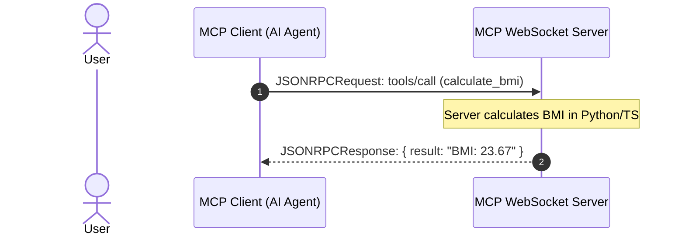
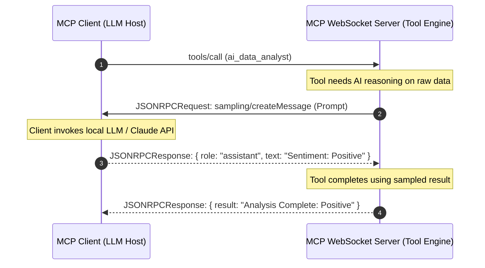
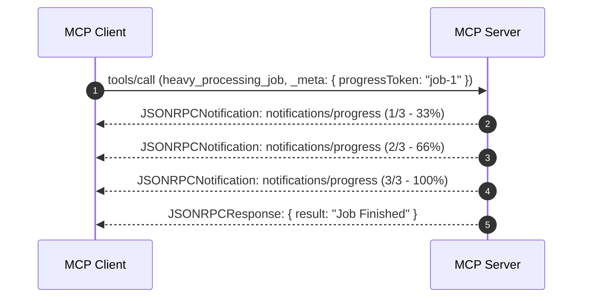

# Model Context Protocol (MCP) WebSocket Transport Specification

> **A Full-Duplex, Symmetric Transport Protocol for Real-Time & Reverse-Request MCP Architectures**  
> *Author: Serguei Castillo*  
> *Status: Proposal / Production Implementation*  
> *Reference Repositories: Python (`mcp-websocket`) | TypeScript (`mcp-websocket`)*

---

## 1. Executive Summary & Problem Statement

The official Model Context Protocol (MCP) specification defines two standard transports:
1. **Standard I/O (`stdio`)**: Optimal for local subprocess communication, but strictly confined to a single host process lifecycle.
2. **Streamable HTTP (`HTTP POST + SSE`)**: Designed for remote network deployment.

### The Limitations of StreamableHTTP & SSE:
* **Asymmetric Server-to-Client Requests**: In MCP advanced workflows—notably **Sampling** (`sampling/createMessage`) and **Roots Discovery** (`roots/list`)—the *server* must initiate requests to the *client*. Over SSE, server requests travel down an event stream, but client responses must be sent via separate HTTP `POST` requests correlated with `Mcp-Session-Id` and message `id`. If the SSE connection drops or proxies buffer headers, the reverse request chain fails.
* **Progress Notification Overhead**: Long-running tool executions streaming progress updates (`notifications/progress`) over HTTP endpoints frequently trigger proxy timeouts (504 Gateway Timeout) unless continuous chunk flushing is maintained.
* **Distributed State Dilemma**: Stateless HTTP load balancers and multi-worker ASGI/Node servers require Redis backplanes or sticky sessions to route client POST responses back to the specific worker thread maintaining the SSE stream.

---

## 2. The WebSocket Solution

**WebSocket Transport** provides a single, persistent, full-duplex TCP/TLS connection (`ws://` / `wss://`) between the MCP Client and Server.

```
┌─────────────────────────────────────────────────────────────┐
│                    MCP Client (Host/AI)                     │
│  - Sends Tools/Prompts/Resources requests                   │
│  - Receives & executes Sampling requests (LLM completions)  │
│  - Receives unprompted Progress & Logging streams           │
└──────────────────────────────┬──────────────────────────────┘
                               │
               Full-Duplex TCP │ 1 Socket (ws:// / wss://)
                  JSON-RPC 2.0 │ No Session Header Routing
                               ▼
┌─────────────────────────────────────────────────────────────┐
│                    MCP Server (Backend)                     │
│  - Serves Tools, Resources, Prompts                         │
│  - Initiates `sampling/createMessage` to Client             │
│  - Initiates `roots/list` queries to Client                 │
│  - Streams `notifications/progress` & `notifications/msg`   │
└─────────────────────────────────────────────────────────────┘
```

---

## 3. Protocol Message Flows

### A. Client-Initiated Tool Invocation


### B. Server-Initiated Reverse Sampling (`sampling/createMessage`)


### C. Real-Time Server Progress Push (`notifications/progress`)


---

## 4. Transport Comparison Matrix

| Feature | `stdio` | `StreamableHTTP` (SSE + POST) | `WebSocket Transport` |
| :--- | :--- | :--- | :--- |
| **Network Remote Capable** | ❌ (Local only) | ✅ Yes | ✅ Yes |
| **Duplex Symmetry** | ✅ Symmetric | ❌ Asymmetric (SSE + separate POSTs) | ✅ **Fully Symmetric** |
| **Server-Initiated Sampling** | ✅ Native | ⚠️ Complex (Needs session correlation) | ✅ **Native & Instant** |
| **Progress Streaming** | ✅ Native | ⚠️ Gateway/Proxy timeout risks | ✅ **Zero-buffering frames** |
| **Header Overhead** | Low (None) | High (~500B per HTTP POST) | **Minimal (2–10 bytes per frame)** |
| **State Complexity** | Tied to process | Requires distributed session store | **1:1 Socket Lifecycle** |

---

## 5. Universal Desktop Host Bridge (`mcp-ws-bridge`)

While custom AI agents and web clients connect to WebSocket servers natively, desktop hosts (Claude Desktop, LM Studio, Cursor, Antigravity) only execute local child processes using `stdio`.

To provide 100% plug-and-play compatibility, both Python and TypeScript packages provide **`mcp-ws-bridge`**:

```
┌────────────────────────────────────────────────────────────┐
│      Claude Desktop / LM Studio / Cursor / Antigravity     │
│                     (STDIO Interface)                      │
└─────────────────────────────┬──────────────────────────────┘
                              │ Standard I/O (stdin/stdout)
                              ▼
┌────────────────────────────────────────────────────────────┐
│                     `mcp-ws-bridge`                        │
│           (Cross-Platform Transparent Pipe)                │
└─────────────────────────────┬──────────────────────────────┘
                              │ Full-Duplex WebSocket (ws://)
                              ▼
┌────────────────────────────────────────────────────────────┐
│                  Remote MCP WebSocket Server               │
│                (Localhost, Docker, Cloud)                  │
└────────────────────────────────────────────────────────────┘
```

The bridge pipes `stdin` lines directly into WebSocket frames and writes WebSocket responses to `stdout` with automated retry reconnects and sub-millisecond throughput.

---

## 6. Automated Verification & Test Proofs

Both Python and TypeScript implementations include automated test suites covering all full-duplex flows.

### Python Test Suite (`uv run --all-extras pytest -v`):
```text
============================= test session starts =============================
platform win32 -- Python 3.13.3, pytest-9.1.1, pluggy-1.6.0
plugins: anyio-4.14.2, asyncio-1.4.0
collected 2 items

tests/test_bidirectional_sampling_and_progress.py::test_full_duplex_bidirectional_transport PASSED [ 50%]
tests/test_transport.py::test_websocket_transport_roundtrip PASSED                       [100%]

============================== 2 passed in 1.54s ==============================
```

### TypeScript Test Suite (`bun run test`):
```text
$ node test/run-tests.js && node test/run-bidirectional-tests.js
=== Starting TypeScript MCP WebSocket Transport Test Suite ===
Test 1: Sending Ping request...
✓ Test 1 Passed: Ping roundtrip successful
Test 2: Sending Echo request...
✓ Test 2 Passed: Echo roundtrip successful
=== All TypeScript Tests Passed Successfully! ===

=== Starting TypeScript Full-Duplex Bidirectional Test Suite ===

[TEST 1] Handshake & Reverse Roots Query...
   📥 [Client] Received Server-Initiated `roots/list` request!
✓ Test 1 Passed: Handshake and Server-Initiated Roots successful.

[TEST 2] Server-Initiated Sampling (Server calls Client LLM)...
   📥 [Client] Received Server-Initiated `sampling/createMessage` request!
✓ Test 2 Passed: Reverse Sampling roundtrip completed over WebSocket.

[TEST 3] Server Progress Notifications...
   📊 [Client] Received progress notification: 1/3
   📊 [Client] Received progress notification: 2/3
   📊 [Client] Received progress notification: 3/3
✓ Test 3 Passed: Real-time progress push verified.

=== All TypeScript Bidirectional Tests Passed 100%! ===
```

---

## 6. How to Run the Live Demos

### 1. Run Python Bidirectional Proof:
```bash
cd python
uv run --all-extras pytest tests/test_bidirectional_sampling_and_progress.py -v -s
```

### 2. Run TypeScript Bidirectional Proof:
```bash
cd typescript
bun run test
```
